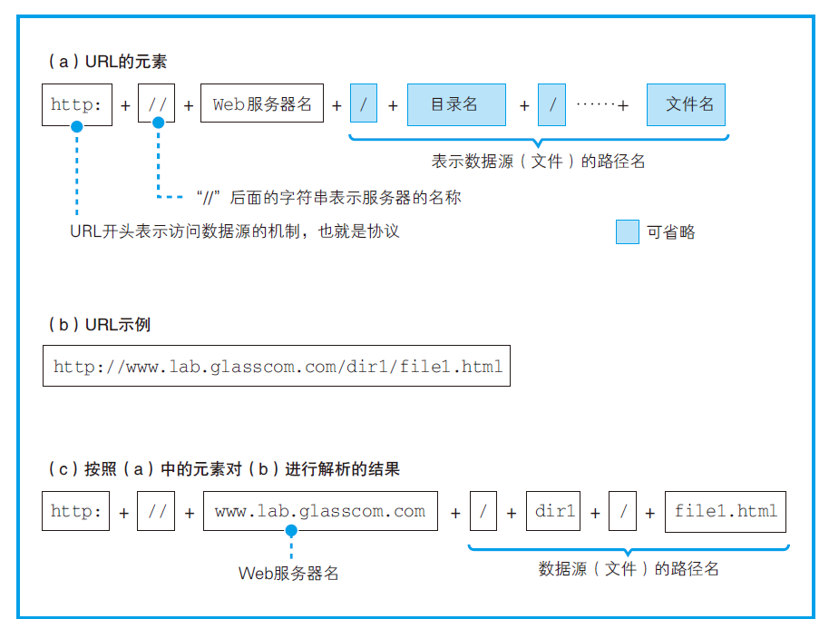
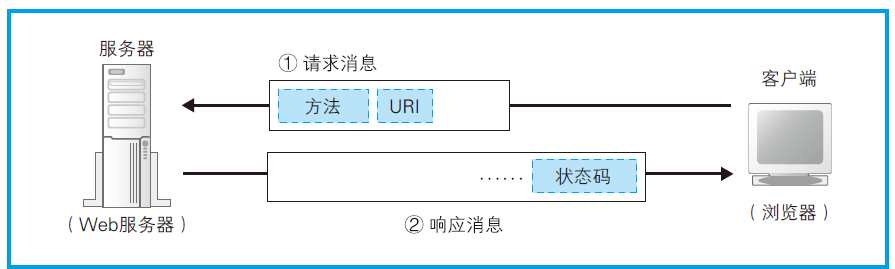
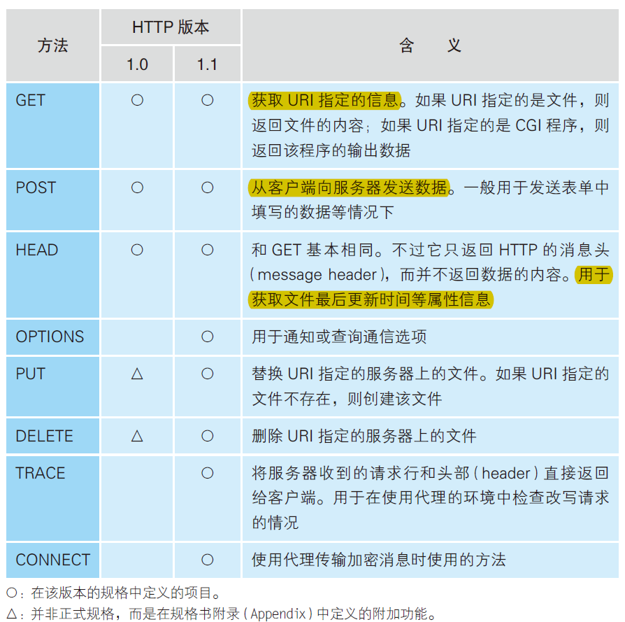
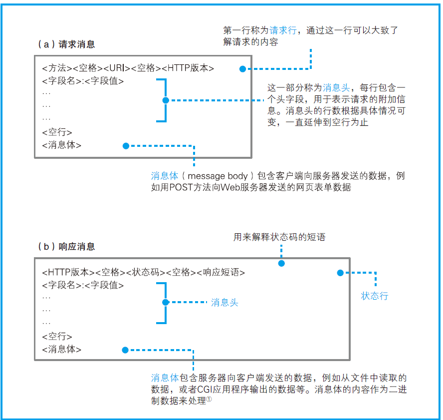
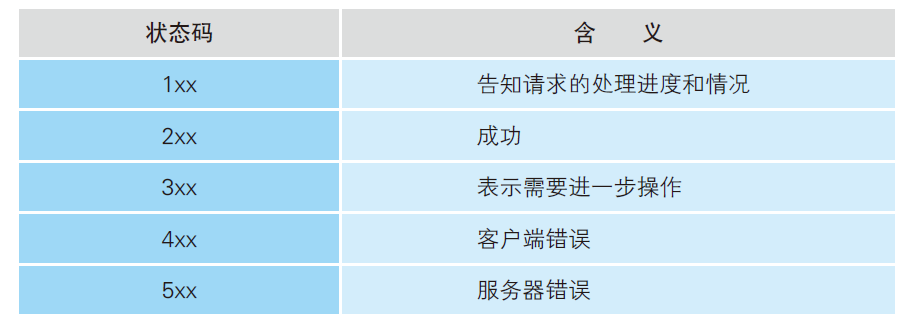

先看看大致流程：

1. 生成 HTTP 请求消息

   当用户在浏览器中输入网址，浏览器就会对 URL 进行解析；然后浏览器会根据网址的含义来生成请求消息。

2. 向 DNS 服务器查询 Web 服务器的 IP 地址

   请求消息生成后，浏览器向 DNS 服务器查询域名对应的 IP 地址，然后委托操作系统（浏览器本身并没有网络通讯的能力）向 Web 服务器发送请求。

3. 委托协议栈发送消息

   查询到IP 地址之后，浏览器就可以将消息委托给操作系统发送给 Web 服务器了。

## 生成 HTTP 请求消息

浏览器要做的第一步工作就是对 URL 进行解析，从而生成发送给 Web 服务器的请求消息。

### 省略文件名的情况

1. http://www.lab.glasscom.com/dir/

   以 `/` 结尾代表访问默认文件，大多数情况下是 `index.html` 或者 `default.htm` 之类的文件。

2. http://www.lab.glasscom.com

   省略结尾的 `/` 符，代表访问服务器根目录下的默认文件，也就是 `index.html` 或者 `default.htm`。

3. http://www.lab.glasscom.com/whatisthis

   如果 Web 服务器上存在名 whatisthis 的文件，则作为文件名来处理；如果存在名为 whatisthis 的目录，则作为目录名来处。

### HTTP 协议

解析完 URL 后，浏览器会使用 HTTP 协议访问 Web 服务器。

HTTP 协议规定了客户端和服务器之间交互的消息内容和步骤，如下图所示，客户端会向服务器发送**请求消息**，包括统一资源标识符（Uniform Resource Identifier， URI）和方法。 

URI 的内容是一个存放网页数据的文件名，就是各种访问目标，例如“/dir1/file1.html”
“/dir1/program1.cgi”等。

请求方法如下图。

收到请求消息后，服务器对其中的内容进行解析，并根据其中的要求完成自己的工作，然后将结果存放在**响应消息**中。响应消息的开头有一个状态码，表示执行结果是成功还是发生了错误。状态码后面就是头字段和网页数据。

响应消息会被发送回客户端，客户端收到之后，浏览器会从消息中读出所需的数据并显示在屏幕上。到这里，HTTP 的整个工作就完成了。

### 生成请求消息

对 URL 进行解析之后，浏览器确定了 Web 服务器和文件名，接下来就是根据这些信息来生成 HTTP 请求消息了。

### 收到响应

在响应消息中，第一行的内容是状态码和响应短语，用来表示请求的结果是成功还是出错。

返回响应消息后，浏览器会将数据提取出来并显示到屏幕上，如果网页的内容只有文字，那么到这里就全部处理完毕了，但如果网页中还包含图片等资源，则还有下文。

浏览器会在显示文字时搜索相应的标签，当遇到图片相关的标签时，会在屏幕中留出用来显示图片的空间，然后再次访问 Web 服务器，按照标签中指定的文件名向 Web 服务器请求相应的图片并显示在预留的空间中。

> 由于每条请求消息中只能写 1 个 URI，所以每次只能获取 1 个文件，如果需要获取多个文件，必须对每个文件单独发送 1 条请求。比如 1 个网页中包含 3 张图片，那么获取网页加上获取图片，一共需要向 Web 服务器发送 4 条请求。

## 向 DNS 查询服务器 IP 地址

