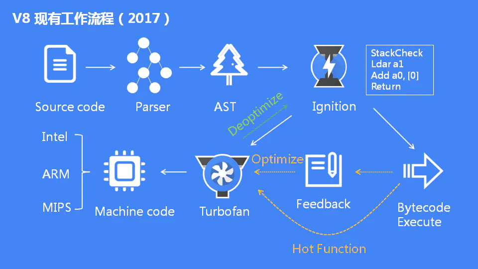

# V8 引擎

在 JavaScript 引擎中，V8 无疑是最流行的，Chrome 与 Node.js 都使用了 V8 引擎。

V8 由很多子模块构成，有几个核心模块：

* Parser：解析器，负责将 JavaScript 代码解析成抽象语法树（Abstract Syntax Tree, AST）；
* Ignition：解释器（interpreter），负责将 AST 转换为字节码（Bytecode）并执行；同时收集 TurboFan 优化编译所需的信息，比如函数参数的类型；
* TurboFan：编译器（compiler），利用 Ignition 所收集的信息，将字节码转换为优化的机器码；

## Parser

为了让 V8 能够理解 JavaScript 代码，必须先将源码通过 **Parser** 解析成抽象语法树——代表程序结构的一系列对象。然后抽象语法树会被 **Ignition** 编译成字节码。这两个阶段是 V8 引擎性能的关键。

下图是 Parser 的工作流程：

整个流程分为两个阶段：词法分析和语法分析。

* **词法分析**：scanner 从我们编写的 JavaScript 代码中生成一系列的 tokens。而 tokens 是由一个或多个具有单一语义的字符组成的块：字符串、标识符、运算符 `++` 等。
* **语法分析**：语法分析的输入就是词法分析的输出（即 tokens），输出是 AST 抽象语法树。当程序出现语法错误的时候，V8 会在语法分析阶段抛出异常。

V8 为了提升 scanner 性能，又做了**延迟解析**（lazy parsing）的优化，一些不会用到函数并不会被马上编译，他们会被 pre-parser 处理，当以后调用一个 preparsed 函数时，它会根据需要进行完全解析和编译。

## Ignition

Ignition 将 AST 转换为字节码，同时会收集 TurboFan 优化所需的信息（比如函数参数的类型信息等），如果函数只调用一次，则 Ignition 会解释执行字节码。

## TurboFan

TurboFan 是一个编译器，可以将字节码编译为 CPU 可以直接执行的机器码。

如果一个函数被多次调用，那么就会被标记为**热点函数**，那么就会经过 TurboFan 转换成优化的机器码，提高代码的执行性能。

但是，机器码实际上也会被还原为字节码，这是因为如果后续执行函数的过程中，类型发生了变化（比如 `sum` 函数原来执行的是 `number` 类型，后来执行变成了 `string` 类型），之前优化的机器码并不能正确的处理运算，就会逆向的转换成字节码。

> 到此，V8 引擎的工作流程就已经完成了，但是还没有细究里面的执行细节，只是大概地了解了工作流程，等以后能完全看懂官方文章了再回来更新。

## 参考链接

1. [JavaScript 引擎 - 维基百科](https://zh.wikipedia.org/wiki/JavaScript%E5%BC%95%E6%93%8E)
2. [JavaScript深入浅出第4课：V8引擎是如何工作的？](https://blog.fundebug.com/2019/07/16/how-does-v8-work/)
3. [Blazingly fast parsing, part 1: optimizing the scanner](https://v8.dev/blog/scanner)
4. [Blazingly fast parsing, part 2: lazy parsing · V8](https://v8.dev/blog/preparser)
5. [Firing up the Ignition interpreter · V8](https://v8.dev/blog/ignition-interpreter)
6. [JavaScript 引擎 V8 执行流程概述](https://mp.weixin.qq.com/s/t__Jqzg1rbTlsCHXKMwh6A)

