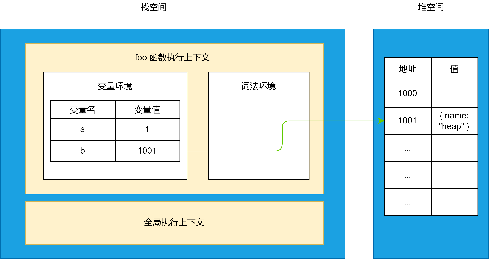
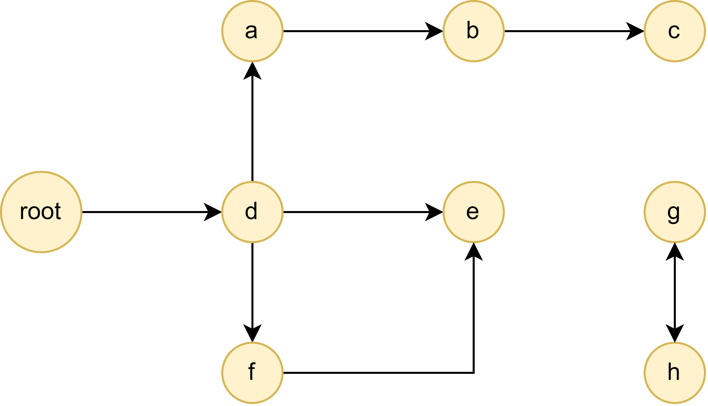

# JavaScript 内存管理

## 内存管理

像 C、C++ 等编程语言都需要手动管理内存，在创建变量时需要申请（`malloc()`），不需要用了之后在释放内存空间（`free()`）。而 JavaScript、Java、Python 等都是自动管理内存，在创建变量时自动分配内存，而在不使用后自动释放，释放的过程称为**垃圾回收**。

虽然不同语言管理内存的方式不同，但是内存声明周期是基本一致的：

1. 分配你所需要的内存
2. 使用分配到的内存（读、写）
3. 不需要时将其释放

第二步的使用内存就很常见了，我们写的代码就是这一步，因此这里介绍第一步和第三步的基本内容。

## V8 内存空间

V8 内存空间主要有三种内存空间：

* 代码空间：主要存储可执行代码；

* 栈空间：JavaScript 对于**基本数据类型**内存的分配会在执行时直接在栈空间进行分配；
* 堆空间：JavaScript 对于**复杂数据类型**内存的分配会在堆内存中开辟一块空间，并且将这块空间的指针（地址）返回给变量引用（存放在栈空间）。

下面看看例子：

```js
function foo(){ 
	var a = 1;
  var b = { name: "heap" };
}
foo()
```



那么，为什么要将复杂数据类型放在堆空间，而不是一起放在栈空间呢？

因为 V8 引擎需要用栈来维护程序执行期间上下文的状态，如果栈空间分配的内存过大，那么会影响到上下文切换的效率，从而导致代码执行速度过慢。

因此，栈空间不会设置太大，主要用来存放基本数据类型（占用空间小），而像复杂数据类型，因为他们的占用空间一般较大，因此会被存放在堆空间中。

## 常见的垃圾回收算法

垃圾回收最困难的任务是找到“哪些被分配的内存确实已经不再需要了”，没有算法可以准确的判断，只是一个近似的过程。下面先介绍几种常见的垃圾回收算法，再介绍 V8 的垃圾回收机制。

### 引用计数算法

这是最初级的垃圾收集算法。此算法把“对象是否不再需要”简化定义为“对象有没有其他对象引用到它”。当一个对象有一个引用指向它时，它的引用数就会 `+1`；当没有引用时，即引用数为 `0`，这个对象就可以被销毁了。

但是一个很大的弊端是会产生循环引用。

```js
function f(){
  var o = {};
  var o2 = {};
  o.a = o2; // o 引用 o2
  o2.a = o; // o2 引用 o

  return "azerty";
}

f();
```

在执行 `f()` 时，创建了两个对象并相互引用。函数执行结束后，会离开函数作用域，因此它们已经没有用了，按照常理来说应该被销毁。但是因为它们至少都有一次引用，所以不会被回收，造成内存泄露。

### 标记清除算法

这个算法把“对象是否不再需要”简化定义为“对象是否可以获得”。

这个算法假定设置一个叫做根（root）的对象（在Javascript里，根是全局对象）。垃圾回收器将定期从根开始，找所有从根开始引用的对象，然后找这些对象引用的对象。



在上图中，`g` 和 `h` 对象互相引用，如果采用**引用计数算法**，那么这两个对象将不会被垃圾回收。但是使用标记清除算法，因为根对象没有对它们引用，因此会被垃圾回收。这样，循环引用的问题就不存在了。

### V8 垃圾回收


## 参考链接

[Trash talk: the Orinoco garbage collector · V8](https://v8.dev/blog/trash-talk)

[内存管理 - JavaScript | MDN (mozilla.org)](https://developer.mozilla.org/zh-CN/docs/Web/JavaScript/Memory_Management)

[12 | 栈空间和堆空间：数据是如何存储的？](https://time.geekbang.org/column/article/129596)

[一文搞懂V8引擎的垃圾回收](https://juejin.cn/post/6844904016325902344)

