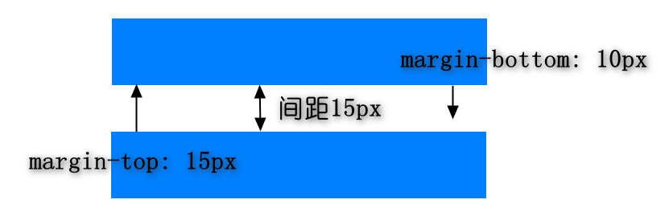
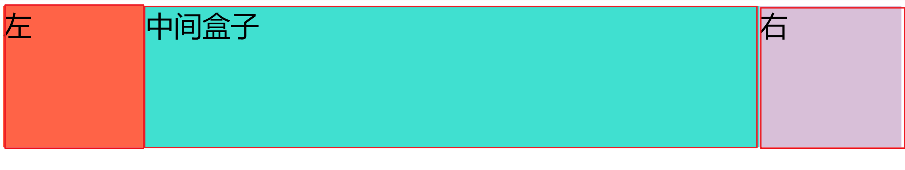

## 2. margin 纵向重叠

- `margin` 纵向重叠取重叠区最大值，不进行叠加
  

## 3. margin 负值问题

- `margin-top` 和 `margin-left` 是负值，元素会向上或者向左移动
- `margin-right` 负值，右侧元素左移，自身不受影响
- `margin-bottom` 负值，下侧元素上移，自身不受影响

## 4. BFC

- `Block Format Context`：块级格式化上下文
- 一块独立的渲染区域，内部元素的渲染不会影响边界以外的元素
- 形成 BFC 的条件
  - `float` 不设置成 `none`
  - `position` 是 `absolute` 或者 `fixed`
  - `overflow` 不是 `visible`
  - `display` 是 `flex` 或者 `inline-block` 等
- 应用：
  - 清除浮动

## 5. float

### 5.1 圣杯布局和双飞翼布局

#### 5.1.1 作用

- 实现 pc 端三栏布局，中间一栏最先渲染
- 实现两边宽度固定，中间自适应
- 效果图
  

#### 5.1.2 圣杯布局

```html
<div class="container clearfix">
  <div class="main float"></div>
  <div class="left float"></div>
  <div class="right float"></div>
</div>
```

```css
.container {
  padding: 0 200px;
  background-color: #eee;
}

/* 清除浮动 */
.clearfix::after {
  content: '';
  display: table;
  clear: both;
}

/* 关键 */
.float {
  float: left;
}

.main {
  width: 100%;
  height: 200px;
  background-color: #ccc;
}

.left {
  width: 200px;
  height: 200px;
  /* ---关键--- */
  position: relative;
  right: 200px;
  margin-left: -100%;
  /* ---关键--- */
  background-color: orange;
}

.right {
  width: 200px;
  height: 200px;
  /* ---关键--- */
  margin-right: -200px;
  /* ---关键--- */
  background-color: skyblue;
}
```

#### 5.1.3 双飞翼布局

```html
<div class="float wrapper">
  <div class="main"></div>
</div>
<div class="left float"></div>
<div class="right float"></div>
```

```css
/* 关键 */
.float {
  float: left;
}

.wrapper {
  width: 100%;
  height: 200px;
  background-color: #ccc;
}

/* 关键 */
.wrapper .main {
  height: 200px;
  margin-left: 200px;
  margin-right: 200px;
}

.left {
  width: 200px;
  height: 200px;
  /* 关键 */
  margin-left: -100%;
  background-color: orange;
}

.right {
  width: 200px;
  height: 200px;
  /* 关键 */
  margin-left: -200px;
  background-color: skyblue;
}
```

#### 5.1.4 对比

|              | 圣杯布局                  | 双飞翼布局         |
| ------------ | ------------------------- | ------------------ |
| HTML         | 包裹三栏                  | 只包裹中间一栏     |
| 是否定位     | 相对定位                  | 无需定位           |
| 左右栏的空间 | 使用 `padding` 预留       | 使用 `margin` 预留 |
| 左栏处理     | `positon` + `margin-left` | `margin-left`      |
| 右栏处理     | `margin-right`            | `margin-left`      |

### 5.2 手写 clearfix

```css
/* 1、父级标签定义伪类 */
.clearfix::after {
  content: '';
  display: table;
  clear: both;
}
/* 兼容IE低版本 */
.clearfix {
  *zoom: 1;
}

/* 2、父级标签 overflow */
.clearfix {
  overflow: hidden;
}

/* 3、添加空 div 标签 */
.clearfix {
  clear: both;
}
```

## 7. 样式单位

* em：相对于自身字体大小的单位
* rem：相对于 html 标签字体大小的单位
* vh：相对于视口高度大小的单位，20vh == 视口高度/100*20
* vw：相对于视口宽度大小的单位,  20vw == 视口宽度/100*20