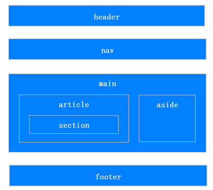

# HTML

## HTML 标签的类型

`!DOCTYPE`：

* 告诉浏览器页面使用的 HTML 版本

`head`：

* 所有头部元素的容器，包括 `meta`、`link`、`style`、`title` 等标签

`body`：

* 文档的主体内容

## HTML5 新特性

* 选择器 `query.selector` 和 `query.selectorAll`
* 拖拽释放 `drag`、`drop` API
* 媒体 `vedio`、`audio` 标签
* 本地存储 `localStorage` 和 `sessionStorage`

## 伪类和伪元素

伪类：用于为已有元素处于某种状态时添加对应的样式。

伪元素：用于创建一些在 DOM 树中不存在的元素，并为其添加样式。

## HTML5 语义化

HTML5中加入了一些语义化标签，来更清晰的表达文档结构。

语义化优点：

- 易于用户阅读，在丢失 CSS 样式的时候仍能呈现清晰的结构
- 方便屏幕阅读器解析，如盲人阅读器根据标签渲染网页
- 便于 SEO 搜索引擎优化，搜索引擎根据标签来确定上下文和关键字的权重
- 有利于开发人员维护
