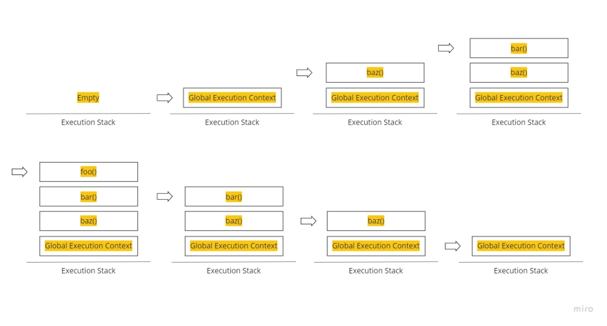

## 执行上下文

执行上下文（Execution Context）是 JavaScript 代码执行时所在的环境，一共有三种不同的执行上下文：

* 全局执行上下文（Global Execution Context, GEC）：最基本的执行上下文，在一开始就会进行初始化：创建全局上下文，将 this 指向这个对象；一个 JavaScript 程序只有一个 GEC；浏览器环境中的全局对象是 window，在 node 环境中全局对象是 global；
* 函数执行上下文（Function Execution Context, FEC）：函数只有在调用时才会产生一个函数执行上下文；
* Eval执行上下文（Eval Execution Context, EEC）：eval 函数执行时产生的执行上下文。

下面是一个简单的例子：

```js
/* global execution context */
function baz() {
  // FEC of baz
  var foo = 3;
  console.log(foo); // 3
}

function bar(){
  // FEC of bar
  var foo = 2;
  console.log(foo); //2
  baz();
}

var foo = 1; //GEC
console.log(foo); //1
bar();
console.log(foo); //1
/* global execution context */
```

1. 当程序执行时，首先 JS 引擎会创建一个 GEC，不在函数内的代码都是 GEC 的一部分；
2. 当函数被调用时，会创建对应的 FEC，函数内部的代码会马上执行；
3. **每一个执行上下文都有自己的变量环境**，因此尽管 `foo` 被声明了三次，但因为它们在不同的上下文，因此它们是独立的，不会相互影响；


## 执行上下文栈

执行上下文栈（Execution Context Stack）也叫调用栈。

当程序执行时，JS 引擎会创建**全局执行上下文**，并将它压入当前调用栈。每当函数调用时，JS 引擎会创建对应的函数上下文，并将它压入栈顶，当函数执行完毕时，则会将该函数的执行上下文从调用栈弹出。

```js
console.log("global execution context");

function foo() {
  console.log("foo 正在执行");
  console.log("foo 结束执行");
}

function bar() {
  console.log("bar 正在执行");
  foo();
  console.log("bar 结束执行");
}

function baz() {
  console.log("baz 正在执行");
  bar();
  console.log("baz 结束执行");
}

baz();
console.log("program successfully executed");

// global execution context
// baz 正在执行
// bar 正在执行
// foo 正在执行
// foo 结束执行
// bar 结束执行
// baz 结束执行
```

示意图如下：



## ES3 中的执行上下文

上面从宏观角度分析了 JavaScript 执行机制，接下来看看执行上下文中的详细内容。

### 变量对象（variable object, VO）

每个执行上下文都有一个存储变量的对象，称为变量对象，包含当前函数定义的变量、函数、参数。

1. 检查当前上下文的参数列表，将 VO 中的 `arguments` 属性赋值为 `Arguments` 对象；
2. 检查当前上下文中的函数声明，每检查到一个函数声明，则在 VO 中以函数名建立一个属性，指向函数所在的内存地址；
3. 检查所有 var 变量声明，为其赋值。

> 这个操作就是变量提升，但是函数声明会比 var 声明更加靠前。

```js
function baz(a, b) {
  console.log("baz", a, b);

  function foo() {
    console.log("foo");
  }

  var v1;
  var v2 = "v2"
}

baz(a, b);

VO = {
  arguments: Arguments Object,
  foo: 0x111 Function,
  v1: undefined,
  v2: "v2"
}
```

### 活动对象（activation object, AO）

当函数进入执行阶段时，变量对象则会变成一个活动对象，能访问到其中的各种属性。

> 变量对象和活动对象就是同一个东西，只是处于不同时期而已。

### 作用域链（scope chain）

作用域链由当前 AO 和父级 VO 组成。当函数创建时，会有一个名为 `[[scope]]` 的内部属性保存所有父变量对象到其中。

```js
Scope = [AO].concat([[Scope]]);
```

作用域链决定了各级上下文的代码在访问变量和函数时的顺序，在搜索变量时会从最前端开始查找，然后逐级往后，直到找到变量。

### this

执行上下文的最后一个部分为当前函数的调用者，关于 this 的各种问题，见 [this指向](./0007%E3%80%81this%E6%8C%87%E5%90%91.md)。

## ES5 中的执行上下文

ES5 中去除了 ES3 里变量对象和活动对象，取而代之的是词法环境（Lexical Environment）和变量环境（Variable Environment）。

ES5 中的词法环境和变量环境和 ES3 中的变量环境是一样的，只不过分成了两部分而已。其中词法环境绑定的是 `let`、`const` 声明的变量，而变量环境绑定的是 `var` 声明的值。

## 面试题

### 面试题一

```js
var n = 100;

function foo() {
  n = 200;
}

foo();

console.log(n); // 200
```

`foo()` 内的 `n` 会通过作用域链访问到全局执行上下文中的变量 `n`，因此会打印 200。

### 面试题二

```js
function foo() {
  console.log(n); // undefined
  var n = 200;
  console.log(n); // 200
}

var n = 100;
foo();
```

由于变量提升，首先输出 undefined，然后输出 200。

### 面试题三

```js
var a = 100;

function foo() {
  console.log(a); // undefined
  return;
  var a = 200;
}

foo();
```

虽然 `a = 200` 不会执行，但是会被变量提升。

### 面试题四

```js
function foo() {
  var a = b = 10
  // => 转成下面的两行代码
  // var a = 10
  // b = 10
}

foo();

console.log(a); // a is not undefined
console.log(b); // 10
```

### 面试题五

```js
var foo = 1;

function bar (foo) {
  console.log(foo); // 123
  foo = 234;
}

bar(123);
console.log(foo); // 1
```

运行 `bar` 函数的时候将 `123` 数字作为实参传入，所以操作的还是本地作用域的 `foo`。

## 参考链接

[What is the Execution Context, Execution Stack & Scope Chain in JS - DEV Community](https://dev.to/ahmedtahir/what-is-the-execution-context-execution-stack-scope-chain-in-js-26nc)

[面试官：说说执行上下文吧 - 掘金 (juejin.cn)](https://juejin.cn/post/6844904158957404167)
