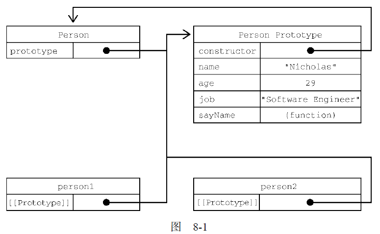

# 创建对象

虽然使用 Object 构造函数或对象字面量可以方便地创建对象，但这些方式也有明显不足：创建具有同样接口的多个对象需要重复编写很多代码。

而且 ES5 并没有正式地支持面向对象的结构。本文主要介绍 ES5 以前模拟类或继承的方法。

## 工厂模式

工厂模式是一种常见的设计模式，通过工厂方法返回想要的对象。

```js
function createPerson(name, age, job) {
  let o = new Object();
  o.name = name;
  o.age = age;
  o.job = job;
  o.sayName = function() {
    console.log(this.name);
  };
  
  return o;
}

let person = createPerson("Nicholas", 29, "Software Engineer");

console.log(person);
// {
//   name: 'Nicholas',
//   age: 29,
//   job: 'Software Engineer',
//   sayName: [Function (anonymous)]
// }
```

这种工厂模式虽然可以解决创建多个类似对象的问题，但没有解决对象标识问题（即新创建的对象是什么类型）。打印对象时，都是 `Object` 类型。

## 构造函数模式

构造函数也称构造器（constructor），是创建对象时会调用的函数。

如果一个函数使用 new 操作符调用，那么这个函数就被称为构造函数（一般首字母大写）。

```js
function Person(name, age, job){
  this.name = name;
  this.age = age;
  this.job = job;
  this.sayName = function() {
  	console.log(this.name);
  };
}

let person1 = new Person("Nicholas", 29, "Software Engineer");
let person2 = new Person("Greg", 27, "Doctor");

console.log(person1);
// Person {
//   name: 'Nicholas',
//   age: 29,
//   job: 'Software Engineer',
//   sayName: [Function (anonymous)]
// }
```

**使用 new 操作符，执行如下操作：**

1. 在内存中创建一个新的对象。
2. 这个新对象内部的 [[Prototype]] 属性被赋值为构造函数的 prototype 属性。
3. 构造函数内部的 this 被赋值为这个新对象（即 this 指向新对象）。
4. 执行构造函数内部的代码（给新对象添加属性）。
5. 如果构造函数返回非空对象，则返回该对象；否则，返回刚创建的新对象。

**构造函数存在的问题：**

构造函数虽然解决了工厂模式没有对象标识的问题，但是它的问题在于定义的方法会在每个实例上都创建一次。

要解决这个问题，可以把函数定义转移到构造函数外部：

```js
function Person(name, age, job){
  this.name = name;
  this.age = age;
  this.job = job;
  this.sayName = sayName;
}

function sayName() {
	console.log(this.name);
}

let person1 = new Person("Nicholas", 29, "Software Engineer");
let person2 = new Person("Greg", 27, "Doctor");

person1.sayName(); // Nicholas
person2.sayName(); // Greg
```

但是如果这个对象需要多个方法，就要在全局作用域上定义多个函数，这会污染全局作用域。这个问题可以通过原型模型来解决。

## 原型模式

在通过对象访问属性时，会按照这个属性的名称开始搜索。搜索开始于对象实例本身。如果在这个实例上发现了给定的名称，则返回该名称对应的值。如果没有找到这个属性，则搜索会沿着原型链（隐式原型）继续查找。

1. 隐式原型

   每个**对象**都有一个特殊的内置属性 [[prototype]]，这个特殊的对象指向另外一个对象。早期的 ECMA 没有规范如何去查看 [[prototype]]，因此浏览器给对象提供一个 `__proto__` 属性来查看这个属性。

   ```js
   var obj = { name: "why" };
   
   console.log(obj.__proto__); // {}
   ```

   ES5 之后提供了 `Object.getPrototypeOf()` 查看：

   ```js
   console.log(obj.getPrototypeOf(obj)); // {}
   ```

2. 显式原型

   函数作为对象，也拥有隐式原型 [[prototype]] 属性。

   此外，每个函数都会创建一个 `prototype` 属性，称为函数的显示原型。这个属性指向原型对象，包含应该由特定引用类型的实例共享的属性和方法。所有原型对象自动获得一个名为 constructor 的属性，指回与之关联的构造函数。

   ```js
   function foo() {
     
   }
   
   console.log(foo.prototype); // {}
   ```

在前面 new 关键字的步骤时：

1. 在内存中创建一个新的对象。
2. 这个新对象内部的 [[Prototype]] 属性被赋值为构造函数的 prototype 属性。
3. 构造函数内部的 this 被赋值为这个新对象（即 this 指向新对象）。
4. ...

也就是说，**构造函数的显示原型会被赋值给新对象的隐式原型**。

```js
/*
* new 的过程
*/
function foo() {
  var newObj = {};
  newObj.__proto__ = foo.prototype;
  this = newObj;
}
```

```js
function Person() {}

let person1 = new Person(), person2 = new Person();

/**
* 正常的原型链都会终止于 Object 的原型对象
* Object 原型的原型是null
*/
console.log(Person.prototype);
// {
// 	constructor: f Person(),
// 	__proto__: Object
// }
console.log(Person.prototype.__proto__ === Object.prototype); // true
console.log(Person.prototype.__proto__.constructor === Object); // true
console.log(Person.prototype.__proto__.__proto__ === null); // true

/**
* 如前所述，构造函数有一个 prototype 属性
* 引用其原型对象，而这个原型对象也有一个
* constructor 属性，引用这个构造函数
* 换句话说，两者循环引用：
*/
console.log(Person.prototype.constructor === Person); // true

/**
* 实例的隐式原型即为构造函数的显式原型
*/
console.log(person1.__proto__ === Person.prototype); // true

/**
* 同一个构造函数创建的两个实例
* 共享同一个原型对象：
*/
console.log(person1.__proto__ === person2.__proto__); // true
```

下面来看看原型对象的关系图。

```js
function Person() {}
  
Person.prototype.name = "Nicholas";
Person.prototype.age = 29;
Person.prototype.job = "Software Engineer";

Person.prototype.sayName = function() {
  console.log(this.name);
};

let person1 = new Person();
person1.sayName(); // "Nicholas"

let person2 = new Person();
person2.sayName(); // "Nicholas"

console.log(person1.sayName == person2.sayName); // true
```




其他原型语法：上面定义原型时语法有点冗余，因此常用对象字面量直接重写函数原型。

```js
function Person() {}

Person.prototype = {
  name: "Nicholas",
  age: 29,
  job: "Software Engineer",
  sayName() {
  console.log(this.name);
  }
};

// 使 constructor 属性不可枚举
Object.defineProperty(Person.prototype, "constructor", {
  enumerable: false,
  value: Person
});
```

**原型模式是实现所有原生引用类型的模式，所有原生引用类型的构造函数（包括Object、Array、String 等）都在原型上定义了实例方法，因此我们才能调用那些方法。**

**原型的问题：**

原型模式也不是没有问题。首先，它弱化了向构造函数传递初始化参数的能力，会导致所有实例默认都取得相同的属性值。虽然这会带来不便，但还不是原型的最大问题。原型的最主要问题源自它的共享特性。

我们知道，原型上的所有属性是在实例间共享的，这对函数来说比较合适。另外包含原始值的属性也还好，可以通过在实例上添加同名属性来简单地遮蔽原型上的属性。真正的问题来自包含引用值的属性。

```js
function Person() {}

Person.prototype = {
  constructor: Person,
  name: "Nicholas",
  age: 29,
  job: "Software Engineer",
  friends: ["Shelby", "Court"],
  sayName() {
		console.log(this.name);
	}
};

let person1 = new Person();
let person2 = new Person();

person1.friends.push("Van");

console.log(person1.friends); // "Shelby,Court,Van"
console.log(person2.friends); // "Shelby,Court,Van"
console.log(person1.friends === person2.friends); // true
```

 