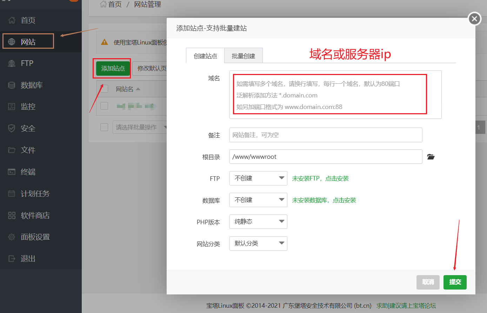
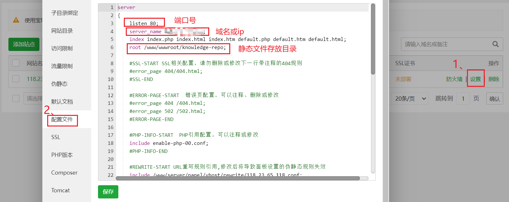
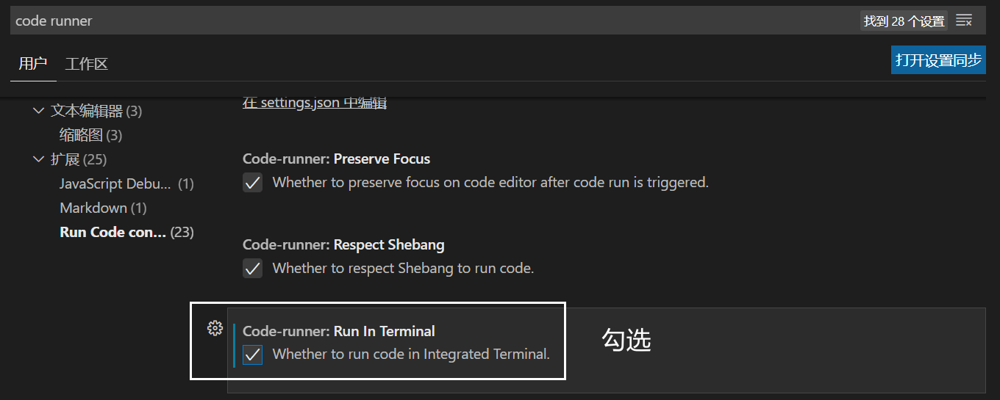

# 自动部署 Vuepress 到服务器

:::tip
服务器：centos 7.9

本地电脑：Windows 10
:::

## 服务器端

### 配置 nginx

登录宝塔面板，可以参考[配置宝塔面板](0003、配置宝塔面板.md)。点击左侧网站 -> 添加站点。



新增之后，点击设置 -> 配置文件。这三项按自己的情况配置，在后面 [git hooks](0004、自动部署.md#配置-hooks) 中会将 dist 文件推送到 `root` 配置项设置的文件夹下。



### 配置 git 仓库

参照[搭建 git 私服](0002、搭建%20git%20私服.md)初始化 `vuepress.git` 仓库。

```bash
cd /home/git
mkdir vuepress.git
cd vuepress.git
git init --bare vuepress.git
```

### 配置 hooks

## 本地电脑

在本地项目根目录下新建 `deploy.sh` 脚本文件，内容如下：

```bash
#!/usr/bin/env sh

# 确保脚本抛出遇到的错误
set -e

# 生成静态文件
yarn build

# 进入生成的文件夹
cd docs/.vuepress/dist

# 初始化 git 仓库，并提交修改
git init
git add -A
git commit -m 'deploy'

# 发布到 git 私服， -f 强制覆盖
git remote add origin git@119.23.65.118:/home/git/knowledge-repo.git
git push -f git@119.23.65.118:/home/git/knowledge-repo.git master

cd -
```

> 了解更多 git 命令，可以查询[官方文档](https://git-scm.com/docs)。

## 测试

vscode 终端中输入 `sh depoly.sh`，报错：

```bash
sh : 无法将“sh”项识别为 cmdlet、函数、脚本文件或可运行程序的名称。
请检查名称的拼写，如果包括路径，请确保路径正确，然后再试一次。
```

了解到 windows 上可以使用 git bash 执行 shell 脚本，但我可不想每次执行的时候都打开 git bash，当然得找如何在 vscode 中执行 shell 脚本的办法。

1. 首先得在 vscode 中安装 code runner，之前一直用它来调试力扣上的题，已经安装过了。
   
2. 安装 git bash，这个不用说，安装 git 的时候就已经有了
   
3. 配置 bash 环境，找到bash.exe的安装目录，将它的位置添加到系统的环境变量中。
   
4. 配置 code runner：文件 -> 首选项 -> 设置 -> 搜索 code runner
   
   

5. 打开终端，输入 `bash` 切换到 bash 环境，点击右上角的三角形即可运行。

## 参考链接

[只需三步， 部署Vuepress 并实现本地一行命令更新部署到服务器](http://chanwingwah.info/article/604eb2273c8ec67668f6fd41)

[使用git hooks(post-receive)实现简单的远程自动部署](https://www.imqianduan.com/git-svn/335.html)

[将Hexo部署到阿里云轻量服务器（保姆级教程）](https://hjxlog.com/posts/20191130a1.html#7-%E9%85%8D%E7%BD%AENginx)

[VSCode: Windows 下配置 VSCode运行shell](https://www.cnblogs.com/yongdaimi/p/15247771.html)